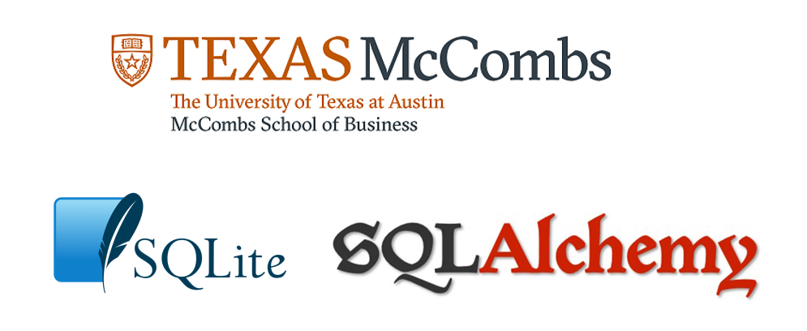
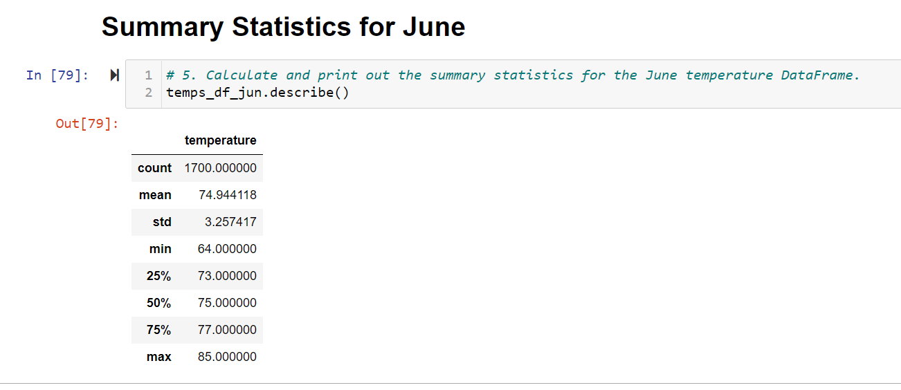
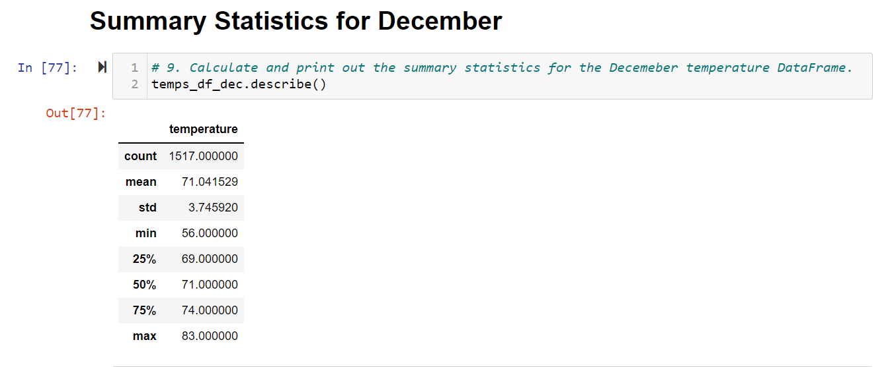

# Surfs UP analysis

## 1. Overview of the analysis

This is the challenge activity for the module 9 of the Data Analytics and Visualization Boot Camp of the university of Texas at Austin.
The main idea is to apply the learned skills of SQLite and SQLAlchemy

The project  was based on data of about  19,550 records in 9 weather stations in the Hawai area.
The main objective of the analysis was to determine the weather trends in two specific months, June and December.
Below we can see a sample of the data in SQLite
 
 
 

## 2. Results:

### Deliverable 1: Determine the Summary Statistics for June

Using Python, Pandas functions and methods, and SQLAlchemy, I filtered the date column of the Measurements table in the hawaii.sqlite database to retrieve all the temperatures for the month of June. I then converted those temperatures to a list, created a DataFrame from the list, and generated the summary statistics. See image above.

 
### Deliverable 2 : Determine the Summary Statistics for December

Using Python, Pandas functions and methods, and SQLAlchemy, I filtered the date column of the Measurements table in the hawaii.sqlite database to retrieve all the temperatures for the month of December. I then converted those temperatures to a list, created a DataFrame from the list, and generated the summary statistics. See image above.

## 3. Summary: 

### Summary:  The three key differences in weather between June and December:
	
### How many roles will need to be filled as the "silver tsunami" begins to make an impact?
-	As we can see in the table below,  in the next 5 years  90 thousand employees will have to retire. 
-	This company needs to hire about 18,000 employes per year for the next 5 years.

	
